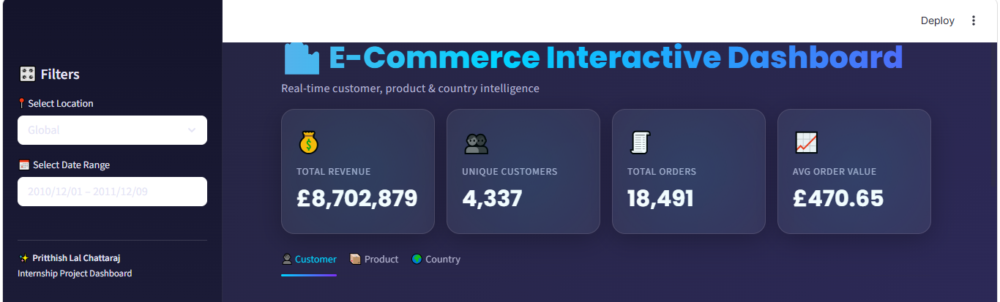
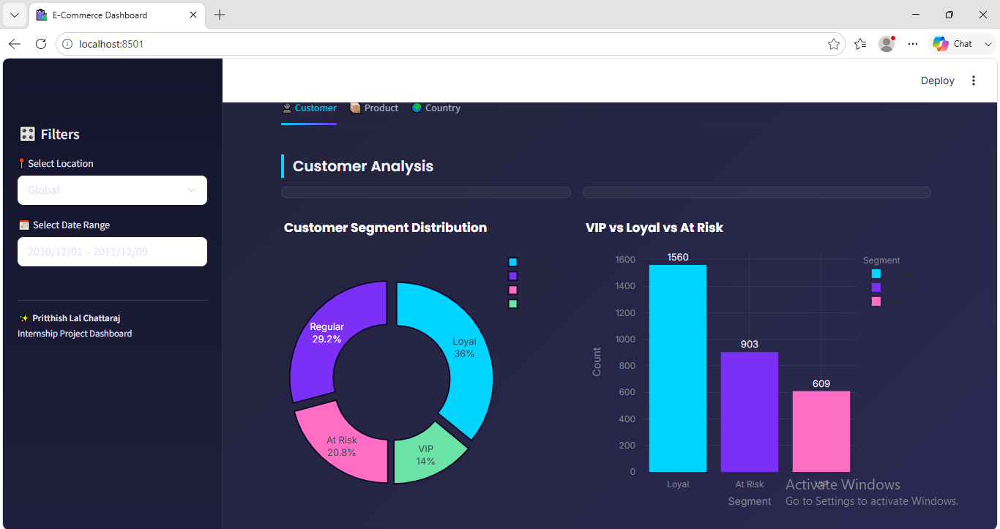
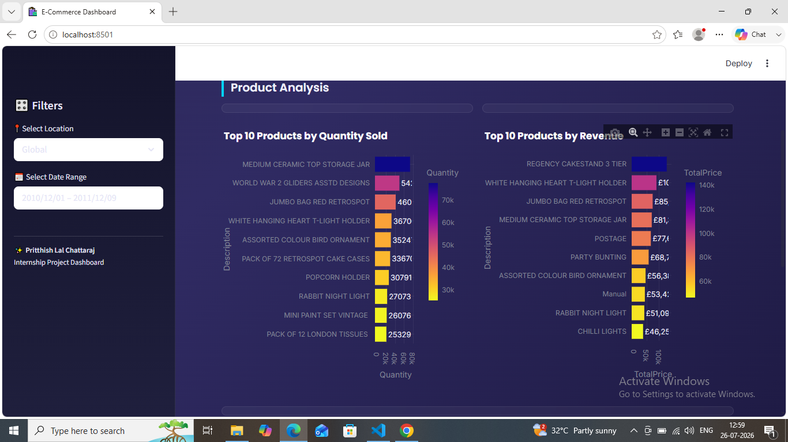
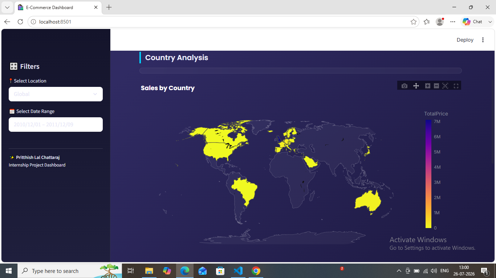
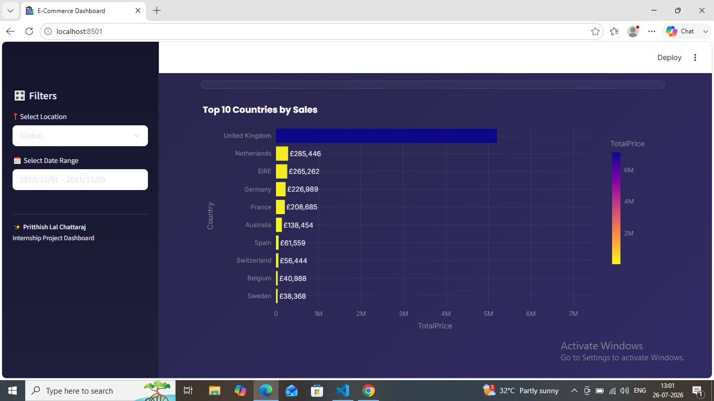

# 🛒 E-Commerce Business Inteligence and Customer Analytics Dashboard

## 📌 Overview

This project is an interactive **E-Commerce Analytics Dashboard** built using **Python** and **Streamlit**. It helps businesses analyze customer purchasing behavior using **RFM (Recency, Frequency, Monetary) Analysis** and provides insights into sales performance through interactive visualizations.

The dashboard enables users to identify valuable customers, explore revenue trends, and make data-driven business decisions.

---

## 🚀 Features

- 📊 Interactive Sales Dashboard
- 👥 Customer Segmentation using RFM Analysis
- 🌍 Revenue Analysis by Region
- 🛍️ Top 10 Best-Selling Products
- 💰 Top 10 Highest Revenue Customers
- 📈 Interactive Charts with Plotly
- 📂 Data Analysis using Pandas & NumPy

---

## 🛠️ Tech Stack

- Python
- Streamlit
- Pandas
- NumPy
- Plotly
- Matplotlib
- Seaborn
- SQLite

---

## 📂 Project Structure

```text
E-COMMERCE-BI-CA/
│
├── app.py
├── README.md
├── requirements.txt
├── data/
├── notebooks/
├── ecommerce.db/
└── images/
```

---

## 📊 Dashboard Insights

The dashboard provides insights including:

- Customer Segmentation based on RFM Analysis
- Revenue by Region
- Top 10 Products by Revenue
- Top 10 Customers by Revenue
- Sales Performance Analysis
- Interactive Business Dashboard

---

## ⚙️ Installation

Clone the repository

```bash
git clone https://github.com/Pritthishtech/E-COMMERCE-BI-CA.git
```

Move into the project folder

```bash
cd E-COMMERCE-BI-CA
```

Install dependencies

```bash
pip install -r requirements.txt
```

Run the application

```bash
streamlit run app.py
```

---

## 📸 Screenshots

### 🏠 Home Page



---

### 👥 Customer Segmentation



---

### 🛒 Product Revenue Analysis


---

### 📦 Top Products



---

### 🌍 Sales by Country



---

### 👤 Top 10 Customers


---

### 🌎 Top 10 Countries by Sales



---

## 🎯 Future Improvements

- Machine Learning-Based Customer Prediction
- Sales Forecasting
- Recommendation System
- User Authentication
- Export Dashboard Reports

---

## 👨‍💻 Author

**Pritthishtech**

GitHub: https://github.com/Pritthishtech